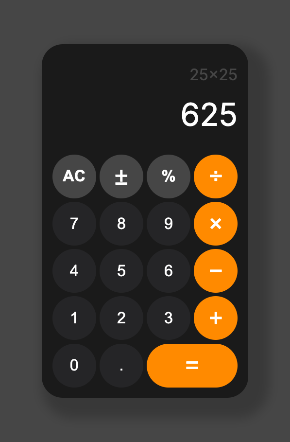

# Calculator 🧮

A browser-based calculator built with HTML, CSS, and JavaScript as part of The Odin Project Foundations course. Implements custom functions for add, subtract, multiply, divide, and expression evaluation.

## 🚀 [Try it out](https://theamanali.github.io/calculator/)


## ✨ Features

- Basic arithmetic functions: add, subtract, multiply, divide
- Clickable buttons for digits (0–9) and operators (+, −, ×, ÷, =)
- Clear button to reset the display
- Decimal input support with single “.” per number
- Single‑pair evaluation with auto‑chaining (e.g., entering “12 + 7 −” yields 19, then uses 19 as the next operand)
- Rounds long decimal results to fit the display

#### To add: 
- Backspace button to undo the last entry
- Error message on division by zero

## 🛠️ Installation

To run locally (using SSH):

```bash
git clone git@github.com:theamanali/calculator.git
cd calculator
open index.html
```
Or, after cloning, simply open `index.html` in your browser!

## 🧰 Technologies Used

- HTML
- CSS (Flexbox)
- JavaScript (DOM manipulation, event listeners)

## 📄 License

This project is licensed under the MIT License.